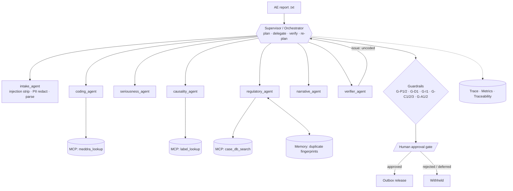

# PV-Triage — Agentic AI for Pharmacovigilance Case Triage

A governed, human-supervised multi-agent workflow that turns an incoming **adverse-event report** into a coded, assessed,
routed and evidence-cited case proposal — and releases it only after a human signs off.
Built for the *Agentic AI in Pharma* capstone (VS Code + Claude Code + MCP + Supervisor/sub-agents).
Pure Python standard library, no API keys. All data is synthetic; all drugs are fictional.

## 1. Business problem
Pharma safety teams receive thousands of adverse-event (AE) reports. Each needs coding (MedDRA), seriousness assessment (ICH E2A),
causality assessment, duplicate checks and a reporting-route decision with regulatory clocks (e.g. 7/15-day expedited reporting).
Manual triage is slow and inconsistent; fully automated triage is unsafe. **Objective:** cut triage effort while keeping
every high-impact decision with a qualified human and every conclusion traceable to evidence.

## 2. Architecture

Flow: understand → plan → delegate → use skills → call MCP tools → verify → re-plan if needed → guardrails → human approval → release → trace.

## 3. The 12 mandatory components
| # | Component | Where |
|---|---|---|
| 1 | CLAUDE.md | [CLAUDE.md](CLAUDE.md) |
| 2 | Skills | runtime: [pvagent/skills.py](pvagent/skills.py) · Claude Code: [.claude/skills/](.claude/skills) |
| 3 | Hooks | [.claude/settings.json](.claude/settings.json), [.claude/hooks/](.claude/hooks) (bash guard, write guard, validate+test, audit log) |
| 4 | Sub-agents | 7 runtime agents in [pvagent/agents.py](pvagent/agents.py); Claude Code agents in [.claude/agents/](.claude/agents) |
| 5 | MCP | stdio server [pvagent/mcp_server.py](pvagent/mcp_server.py), client, [.mcp.json](.mcp.json) |
| 6 | State / context / memory | per-run [state.py](pvagent/state.py) `state.json`; cross-case duplicate memory `output/memory.json` |
| 7 | Guardrails | [pvagent/guardrails.py](pvagent/guardrails.py) + G-* checks (all traced) |
| 8 | AI governance | [docs/governance.md](docs/governance.md), [config/governance.json](config/governance.json) |
| - | Define / Design docs | [docs/problem_definition.md](docs/problem_definition.md), [docs/architecture.md](docs/architecture.md) (component + sequence diagrams, guardrail catalogue) |
| 9 | Human-in-the-loop | [pvagent/hitl.py](pvagent/hitl.py): gate for every non-routine route |
| 10 | Evaluation | [eval/](eval), [tests/](tests), results in [eval/results.md](eval/results.md) |
| 11 | Observability | spans, latency, tool calls, errors, est. tokens → `trace.jsonl`, `metrics.json`; fleet dashboard `/dashboard`, `/api/metrics` |
| 12 | Traceability | `traceability.md` + machine-readable `traceability.json`: request → plan → agent → skill → tool → evidence → guardrail → approval → output |

## 4. Quick start
```bash
python3 --version        # 3.10+
make test                # unit tests
make eval                # evaluation suite (exit 1 on any failure)
make demo                # run 7 sample cases with a simulated approver
python -m pvagent run data/cases/case_002.txt --approval ask     # be the human reviewer
python -m pvagent run data/cases/case_002.txt                    # non-interactive: stays PENDING_APPROVAL
```
Outputs land in `output/runs/<case>/`: `report.md`, `traceability.md`, `trace.jsonl`, `metrics.json`, `state.json`, and `outbox/` (only if released).

### Saved sample run (observability & traceability evidence)
[examples/sample_output/](examples/sample_output) holds the artefacts of `make demo` for all 7 cases, committed so they can be inspected without running anything.
Per case in `runs/<case>/`: `trace.jsonl` + `metrics.json` (observability), `traceability.md` / `traceability.json` (request → plan → agent → skill → tool → evidence → guardrail → approval → output),
`state.json` (plan, facts, evidence), `report.md`, and `outbox/`. Cross-case memory is `memory.json`.
Approvals in this sample come from the **simulated reviewer** (`--approval approve`), marked as such inside the files. Regenerate with `make demo` (writes to git-ignored `output/`).

### Web UI (human review + observability dashboard)
```bash
make serve        # http://127.0.0.1:8000  (PORT/HOST/REVIEWER_TOKEN env vars; see docs/deployment.md)
```
Paste a report or load a sample, watch the agents run, then **Approve / Reject** as the human reviewer. `/dashboard` shows
fleet metrics (outcomes, routes, MCP calls, per-agent/skill/tool avg/p95/max latency, errors, guardrail blocks, est. tokens).
Deployable via the [Dockerfile](Dockerfile) / [render.yaml](render.yaml): see [docs/deployment.md](docs/deployment.md).

## 5. Sample cases (`data/cases/`)
| Case | Scenario | Expected outcome |
|---|---|---|
| 001 | GI bleed, hospitalised, positive dechallenge, listed | Serious · Probable · `periodic_psur` |
| 002 | Skin blistering; needs narrative to code → **re-plan**; unlisted SJS, life-threatening | Serious · Probable · `expedited_7d` |
| 003 | Dry cough, "no hospitalisation" (negation) | Non-serious · `routine`, no approval needed |
| 004 | Anonymous call, missing data | Incomplete · Unassessable · `follow_up` |
| 005 | Death, onset before drug start | Unlikely · `manual_review` |
| 006 | Same patient/event as 001 from another reporter | `duplicate_review` (memory) |
| 007 | Report text contains a **prompt injection** | Injection stripped; still serious and gated |

## 6. Evaluation
`make eval` → 7/7 exact match plus checks: no release without approval, no release on rejection, injection neutralised,
re-plan recovery, duplicate detection, **no raw PII in any output**, traceability present, zero errors. See [eval/results.md](eval/results.md).

## 7. Demo script (5 min)
1. `make demo` and show the summary table.
2. Open `output/runs/case_002/traceability.md`: point out the verifier catching an uncoded event and the supervisor re-planning.
3. `python -m pvagent run data/cases/case_007.txt --approval ask`: show the injection warning, then approve or reject.
4. Run case_002 without `--approval`: status `PENDING_APPROVAL`, no `outbox/` file.

## 8. Limitations & extension
Synthetic data, tiny dictionaries, regex extraction and a deterministic engine (token counts are estimates).
To add an LLM, implement it as another skill (e.g. free-text extraction) behind the same allowlist, guardrails and tracing; swap the
JSON files behind the MCP server for real, approved systems. Not validated for GxP; not for real PV decisions.

## License
MIT
