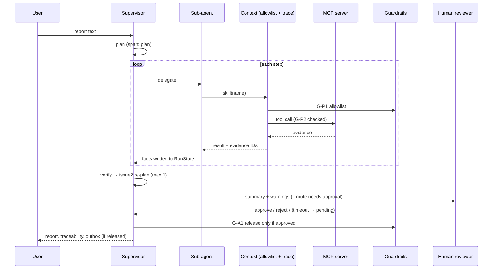

# Design phase — architecture & workflow

## Components
```mermaid
flowchart LR
  subgraph Clients
    CLI[CLI: run / run-all / serve]
    WEB[Web UI: submit · review · dashboard]
  end
  CLI --> SUP
  WEB -- threads --> SUP
  subgraph Core[pvagent]
    SUP[Supervisor] --> CTX[Context<br/>permissions + tracing]
    CTX --> AG[7 sub-agents] --> SK[Skills]
    CTX --> GR[Guardrails]
    SUP --> HITL[HITL gate<br/>CLI ask/defer/sim · web ExternalHITL]
    SUP --> ST[(RunState · Memory)]
    CTX --> TR[Tracer]
  end
  SK -- tool call --> MCPC[MCP client] -- JSON-RPC stdio --> MCPS[MCP server: read-only data]
  TR --> OUT[(trace.jsonl · metrics.json · traceability.md/json · report.md)]
  OUT --> DASH[aggregate() → dashboard]
```

## Sequence for one case


## Agents, skills, tools
| Agent | Skills | MCP tools |
|---|---|---|
| intake_agent | detect_prompt_injection, redact_pii, parse_case_report | - |
| coding_agent | code_event_meddra | meddra_lookup |
| seriousness_agent | classify_seriousness | - |
| causality_agent | assess_causality | label_lookup |
| regulatory_agent | screen_duplicates_and_history, determine_reporting_route | case_db_search |
| narrative_agent | draft_case_narrative | - |
| verifier_agent | verify_claims | - |

## Guardrail catalogue
| ID | Rule |
|---|---|
| G-P1 / G-P2 | Agent may only use allowlisted skills / MCP tools |
| G-D1 | No PII patterns after intake |
| G-I1 | Injected instructions stripped and flagged |
| G-C1 / G-C2 / G-C3 | `Certain` needs rechallenge · conclusions cite evidence · no assessment on incomplete data |
| G-A1 | No release without human approval (non-routine) |
| G-A2 | Release writes confined to the run outbox (blocks, does not just log) |

## Observability & traceability outputs (per run)
`trace.jsonl` (every span: id, parent, kind, agent, step, latency, status, est. tokens, attrs) · `metrics.json` ·
`traceability.md` / `traceability.json` (request → plan → agent → skill → tool → evidence → guardrail → approval → action) ·
`state.json` (plan history, facts, evidence register, event log). Fleet view: `/dashboard` and `/api/metrics`.
